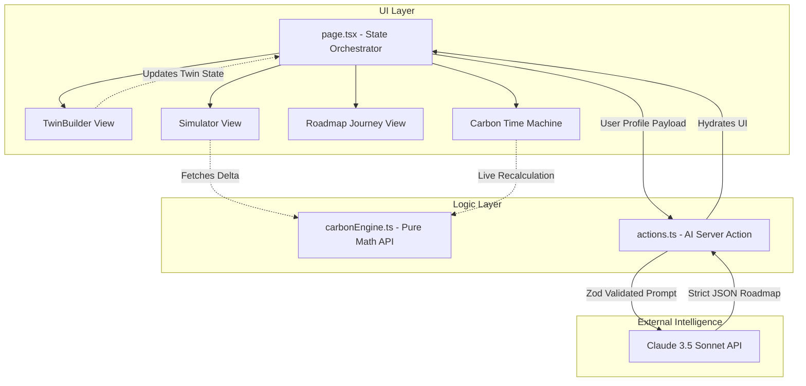

<div align="center">
  
  # 🌍 Carbon Future Planner
  **A GPS for your climate future.**

  [](https://nextjs.org/)
  [](https://reactjs.org/)
  [](https://www.typescriptlang.org/)
  [](https://tailwindcss.com/)
  [](https://www.framer.com/motion/)
  [](https://www.anthropic.com/)

  *An AI-powered climate planning platform that transforms carbon awareness into long-term action.*

  <br />

  > **Most climate apps tell users what they emitted yesterday.**<br>
  > **Carbon Future Planner helps users decide what to do tomorrow.**

</div>

---

## ⚡ The Problem

Most carbon apps explain the past. Almost none help users plan the future. 

Most climate tools stop at awareness.

Awareness does not create change.

People don't need another footprint score.
They need a plan.

---

## ⭐ Signature Innovation

### Carbon Time Machine™

**An interactive climate planning interface that lets users drag through time and instantly visualize how today's decisions shape tomorrow's emissions, savings, and environmental impact.**

*[Insert Screenshot: Carbon Time Machine drag interface here]*

---

## 🚀 Overview

The **Carbon Future Planner** is not a static dashboard or a guilt-tripping footprint calculator. It is an interactive, AI-driven journey that transforms climate anxiety into actionable, psychological momentum. 

By prioritizing emotional design, zero-latency state transitions, and deterministic mathematics, the platform calculates a user's current baseline and uses a generative AI pipeline to sequence a personalized, high-impact climate roadmap.

*[Insert Screenshot: Twin Orb and Vertical Roadmap Journey here]*

### Additional Features

- **The Twin Orb**: An organic, animated `framer-motion` sphere that visually evolves as users input their lifestyle data—proving accuracy visually rather than numerically.
- **Vertical Roadmap Journey**: AI-sequenced behavioral and investment milestones mapped out in a visually striking vertical timeline, guiding the user toward a targeted 2030 destination.
- **Zod-Enforced AI Generation**: Utilizes the Vercel AI SDK to pull structured JSON from Claude 3.5 Sonnet, guaranteeing the roadmap perfectly fits the UI without markdown hallucinations.

---

## 🥊 Why We're Different

| Platform | What they do |
| :--- | :--- |
| **Joro** | Tracks emissions |
| **Klima** | Offsets emissions |
| **Carbon Future Planner** | **Creates personalized reduction roadmaps and future-state planning.** |

---

## 🏆 Hackathon Submission Details

### Chosen Vertical
**Sustainability & Climate Tech** - Focusing on personal and enterprise carbon footprint reduction through predictive planning.

### Approach and Logic
Instead of a standard carbon calculator that guilt-trips users over past emissions, our approach shifts the psychology toward future action. We use a **deterministic math engine** to calculate a baseline footprint and then feed that context into a **Generative AI pipeline**. The AI logically sequences lifestyle changes and investments over a 36-month timeline, sorting them by immediate impact versus long-term cost. 

### How the Solution Works
1. **Context Gathering (The Twin Builder):** The user inputs their housing, commute, diet, and travel habits. A real-time math engine calculates their current footprint.
2. **AI Sequencing:** A server action passes the user's data to Claude 3.5 Sonnet, utilizing strict `zod` schema enforcement to guarantee a 4-phase, JSON-structured roadmap.
3. **Interactive Simulation (Carbon Time Machine):** The user drags a slider across their future timeline. The UI recalculates their projected emissions live based on the milestones they are scheduled to hit in the AI roadmap.

### Assumptions Made
1. **Standardized Baselines:** We assume standard emission coefficients for transport and diet based on IPCC averages (e.g., a flight is assumed to be short-haul unless specified).
2. **Monotonic Reduction:** The Carbon Time Machine assumes that users successfully implement the milestone reductions exactly when the roadmap suggests them.
3. **AI Fallback:** We assume that API rate limits or network issues could happen during live demonstrations, so the system is engineered to automatically fallback to an intelligent, hardcoded localized roadmap if the AI request fails.

---

## 🏗 Architecture

The platform is engineered for extreme resilience during live demonstrations. It eschews complex backends in favor of a monolithic Next.js App Router orchestration layer, a pure math engine, and serverless AI actions.



### Engineering Highlights (V6)
1. **Pure Math Engine (`carbonEngine.ts`)**: The carbon mathematics are completely decoupled from React. A pure, easily testable function handles all IPCC-based baseline calculations.
2. **True Modularization**: 7 independent views extracted into `src/components/views/`, connected by a single lightweight `< 80 line` orchestrator in `page.tsx`.
3. **Graceful Degradation**: If the API key is missing or the network drops, `actions.ts` features an intelligent fallback that dynamically parses the user's Twin profile to generate a hardcoded but structurally valid Zod schema roadmap.

---

## 💻 Getting Started

### Prerequisites
- Node.js `18.17.0` or later.
- `npm` or `pnpm`.

### Installation

1. **Clone the repository**
   ```bash
   git clone https://github.com/ramakrishnanyadav/nexus.git
   cd nexus
   ```

2. **Install dependencies**
   ```bash
   npm install --legacy-peer-deps
   ```

3. **Set up environment variables**
   Create a `.env.local` file in the root directory:
   ```env
   # Optional: For live AI generation. 
   # If omitted, the app will use its intelligent offline fallback.
   ANTHROPIC_API_KEY=sk-ant-api03... 
   ```

4. **Run the development server**
   ```bash
   npm run dev
   ```

5. **Open the application**
   Navigate to [http://localhost:3000](http://localhost:3000) in your browser.

---

## 🧪 Testing

The pure math engine and the core state flow are validated using **Vitest**. The test suite guarantees:
1. **Time Machine Monotonicity**: The footprint at Year 5 is mathematically proven to be lower than Year 1 for any valid twin configuration.
2. **Schema Validity**: The AI fallback mechanism strictly adheres to the Zod `RoadmapSchema`.

Run the test suite:
```bash
npm run test
```

---

## 🔭 Beyond The MVP

- **Climate Twin**: Deeply integrated digital twin mirroring physical resource consumption.
- **Outcome Intelligence Engine**: Big-data aggregated predictions for enterprise sustainability targets.
- **Enterprise Scope 3 Planning**: Tools for organizations to aggregate employee footprints securely.
- **CarbonGPT**: Conversational micro-adjustments to the generated roadmap.

---

## 🎨 Design Philosophy

> *"Less decoration. More meaning."*

- **Typography**: `Inter` font with `tabular-nums` applied to all data metrics to ensure numbers don't jump horizontally during animations.
- **Color System**: A premium dark mode utilizing `#09090B` backgrounds, elevated `#1F2937` surfaces, and single-gradient punctuation (`#22D3EE` to `#4F46E5`).
- **Motion**: Driven entirely by `framer-motion` springs. Motion explains change; it is never used purely for decoration. 

---
<div align="center">
  <i>Engineered for the Carbon Future Hackathon • June 2026</i>
</div>
